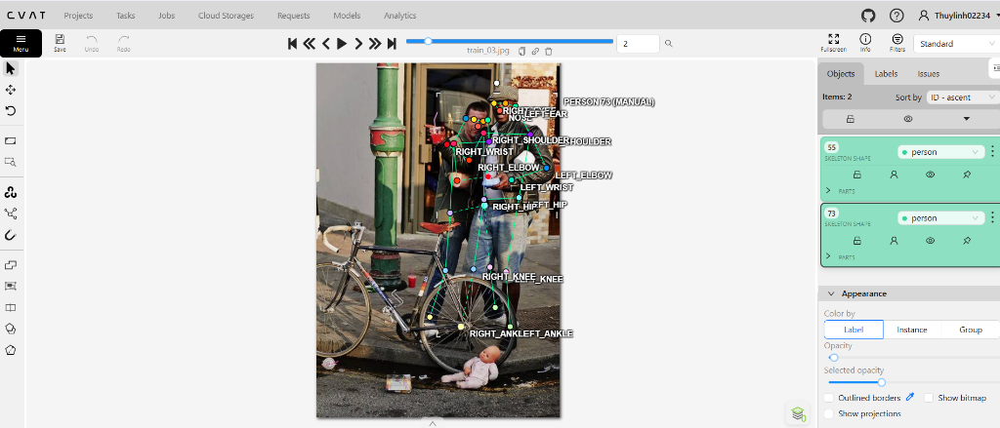
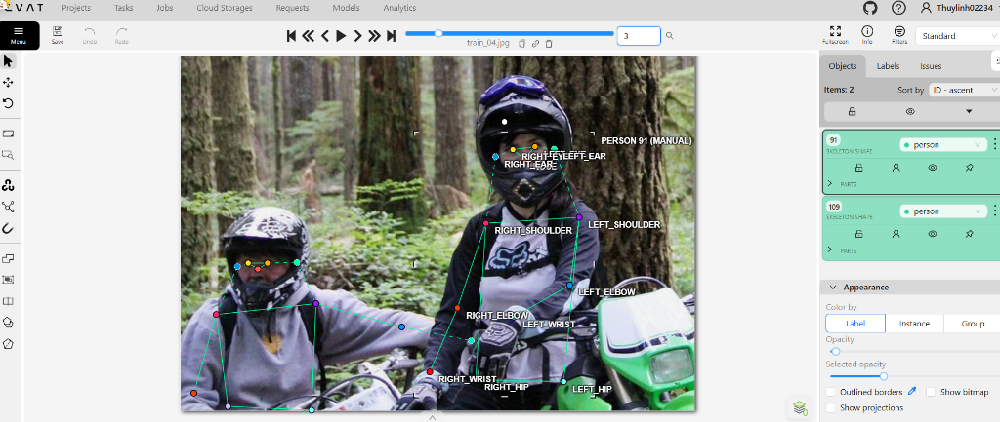
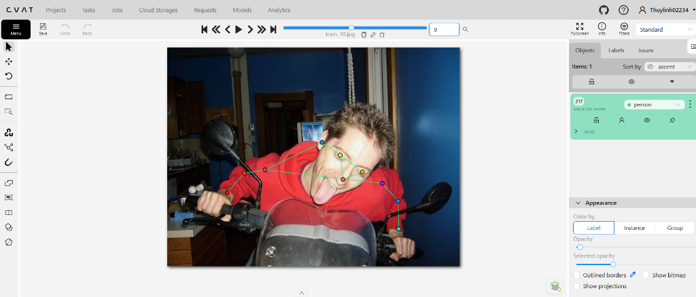
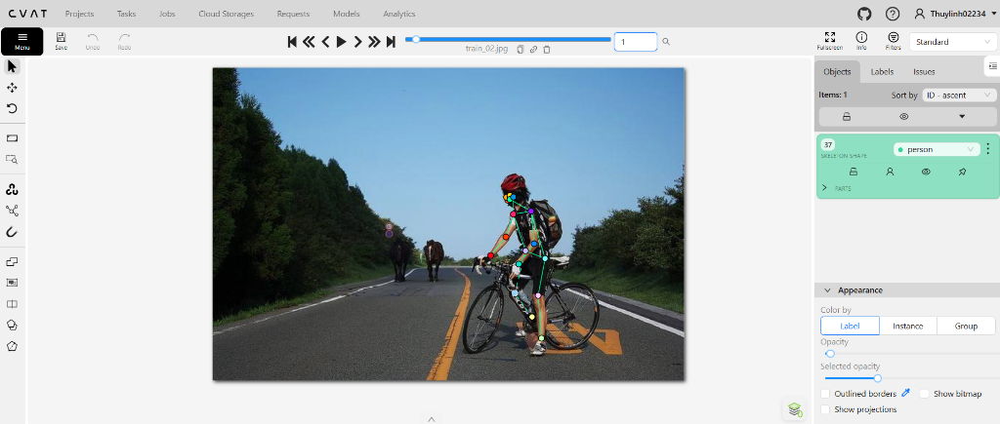
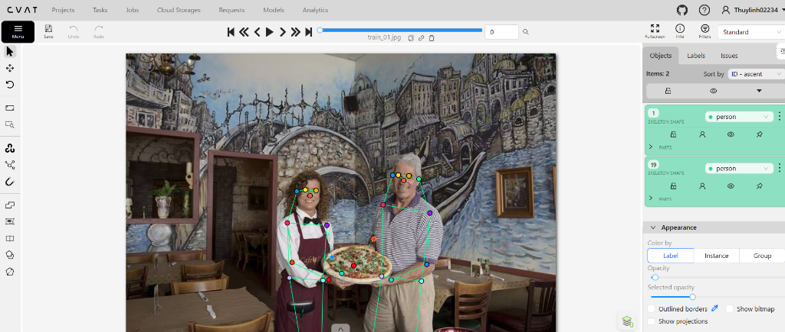
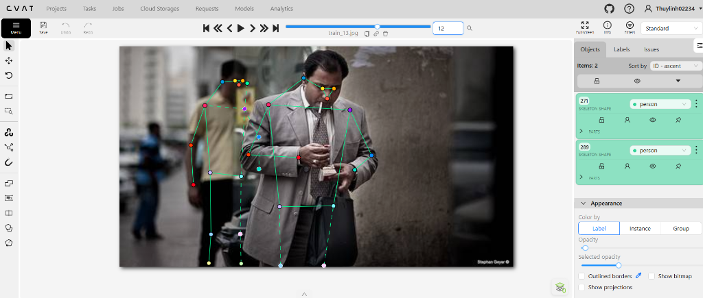

# Mini guideline - nhóm: *(Cá nhân)*  |  người gán: Nguyễn Thị Thùy Linh  |  ngày: 16/09/2026

## 1. Luật bắt buộc (đã thống nhất cả lớp - không sửa)
- Bộ 17 điểm COCO, đúng tên, đúng thứ tự.
- Mọi người trong ảnh đều có **đủ 17 điểm**. Điểm không dùng được thì gắn cờ, không xoá.
- Trái/phải tính theo **cơ thể người**, không theo bức ảnh.
- Bị che, còn trong khung -> `v = 1`, **vẫn đặt chấm** ở vị trí ước lượng.
- Ra ngoài mép ảnh -> `v = 0`, **không** đặt chấm.
- Không dùng `Hidden` (`h`) - nó không được lưu vào file.

---

## 2. Luật của nhóm bạn (kèm ảnh mẫu minh họa - Slide 12)

| Tình huống | Luật nhóm bạn chọn | Vì sao | Ảnh mẫu minh hoạ |
| --- | --- | --- | :---: |
| **1. Hông của người mặc quần áo dài** | Lấy giao điểm nếp gấp đáy quần với mép hông, đặt lệch vào trong 2-3cm, gắn `v=1` | Vùng khớp háng không nhìn thấy bề mặt, phải ước lượng theo tâm xoay giải phẫu của xương đùi | *Xem Mục 2.1 bên dưới* |
| **2. Tai bị tóc hoặc mũ bảo hiểm che một phần** | Nếu thấy chân tóc/vành tai: ước lượng lỗ tai đặt `v=1`. Nếu đội full-face che kín: ước lượng ngang tầm mắt dóng ra mép đầu, gắn `v=1` | Mũ bảo hiểm chỉ che khuất chứ đầu vẫn nằm trọn trong ảnh, không bị lọt ra ngoài khung hình | *Xem Mục 2.2 bên dưới* |
| **3. Người bị cắt ở mép ảnh (từ hông trở lên)** | Các khớp dưới mép ảnh (đầu gối, cổ chân) bắt buộc tick **Outside** (`v=0`), toạ độ `0 0 0` | Khớp không còn trong khung hình thì không được chấm ngoài biên | *Xem Mục 2.3 bên dưới* |
| **4. Cổ tay nằm sau tay lái / sau thân mình** | Đặt chấm tại vị trí nối giữa cẳng tay và bàn tay, tick **Occluded** (`v=1`) | Thấy cẳng tay và bàn tay cầm ghi-đông giúp nội suy vị trí cổ tay với độ chính xác cao | *Xem Mục 2.4 bên dưới* |
| **5. Hai người chồng lên nhau** | Gán trọn vẹn người phía trước trước; người phía sau bị người trước che thì đặt chấm ước lượng và tick `v=1` | Tránh nhầm lẫn xương giữa 2 cơ thể và đảm bảo tính liên tục của skeleton | *Xem Mục 2.5 bên dưới* |
| **6. Người nhỏ đến mức nào thì không gán** | Chiều cao bbox < 30 pixel hoặc không phân biệt được đầu và thân thì bỏ qua | Dưới ngưỡng này dung sai OKS bị co lại quá nhỏ, model không học được đặc trưng | *Xem Mục 2.6 bên dưới* |

---

### Chi tiết 6 ảnh mẫu kèm phân tích (Slide 12: Khớp không có bề mặt nhìn thấy phải có ảnh mẫu)

#### 2.1. Hông của người mặc quần áo dài

- **Căn cứ thị giác (`train_03.jpg`):** Người mặc quần dài che mất mào chậu và mấu chuyển lớn xương đùi.
- **Quy tắc gán:** Dóng một đường ngang qua nếp gấp đáy quần, đặt 2 điểm `left_hip` và `right_hip` đối xứng qua đường giữa thân, cờ chọn **`v=1` (Occluded - màu vàng)**. Không được bỏ trống khớp này.

#### 2.2. Tai bị tóc hoặc mũ bảo hiểm che một phần

- **Căn cứ thị giác (`train_04.jpg` - người lái xe bên phải):** Người đội mũ bảo hiểm cào cào che kín tai hoàn toàn.
- **Quy tắc gán:** Lấy vị trí ngang tầm mắt (`left_eye`, `right_eye`) dóng ngang sang hai bên thái dương ra sát mép mũ, đặt chấm ước lượng và bấm phím `q` để đặt cờ **`v=1` (vàng)**. Tuyệt đối không bấm `o` (Outside) vì đầu người vẫn nằm gọn trong ảnh.

#### 2.3. Người bị cắt ở mép ảnh (từ hông trở lên)

- **Căn cứ thị giác (`train_10.jpg`):** Ảnh chụp nửa thân trên, mép dưới ảnh cắt ngang qua thắt lưng.
- **Quy tắc gán:** Các khớp `right_hip`, `left_knee`, `right_knee`, `left_ankle`, `right_ankle` đã lọt ra ngoài mép dưới ảnh (`y >= 1.0`). Chọn các điểm này và bấm phím `o` (Outside) để đặt cờ **`v=0`**, tọa độ lưu là `0.0 0.0 0`. Không được ước lượng chấm ngoài mép ảnh.

#### 2.4. Cổ tay nằm sau tay lái / sau thân mình

- **Căn cứ thị giác (`train_02.jpg`):** Người đạp xe nắm chặt ghi-đông, khớp cổ tay bị che lấp một phần bởi bàn tay và tay cầm.
- **Quy tắc gán:** Nối từ cùi chỏ (`elbow`) dọc theo xương cẳng tay đến điểm giao với tay lái, chấm tại nếp gấp cổ tay với cờ **`v=1` (Occluded)**.

#### 2.5. Hai người chồng lên nhau

- **Căn cứ thị giác (`train_01.jpg`):** Hai người đứng song song cạnh nhau cùng nâng chiếc đĩa pizza, cánh tay và đĩa bánh che khuất một phần thân người.
- **Quy tắc gán:** Gán xong trọn vẹn 17 điểm cho người phía trước (chủ yếu `v=2`). Sau đó gán người phía sau, các khớp bị cơ thể người trước che thì đặt chấm ước lượng và tick **`v=1`**. Không được kéo điểm của người sau bám vào cơ thể người trước (tránh lỗi "nhầm người").

#### 2.6. Người nhỏ đến mức nào thì không gán nữa

- **Căn cứ thị giác (`train_13.jpg`):** Những người xuất hiện rất xa ở hậu cảnh.
- **Quy tắc gán:** Nếu chiều cao bounding box < 30 pixel, hoặc các bộ phận đầu - thân - chân mờ nhòe không phân biệt được thì **không tạo skeleton**. Chỉ tạo skeleton cho những người đủ lớn để xác định được tối thiểu trục thân chính.

---

## 3. Ba ca mơ hồ đã gặp

### Ca 1 - ảnh `train_04.jpg`, người thứ 2, khớp `left_knee`
- **Mơ hồ ở chỗ nào:** Người lái xe ngồi trên xe cào cào, cẳng chân chúc xuống sát mép đáy ảnh, khó phân biệt đầu gối đã ra ngoài biên hay chưa.
- **Bạn quyết thế nào:** Đặt cờ `v=0` (Outside), tọa độ `0.0 0.0 0`.
- **Vì sao:** Toạ độ vượt quá mép khung hình (`> 1.0`) nên về mặt toán học điểm đó không tồn tại trên ma trận ảnh.
- **Nếu người khác quyết ngược lại thì model học sai cái gì:** Model sẽ học dự đoán toạ độ âm hoặc vượt quá 1.0, làm hỏng hàm mất mát khi chuẩn hóa nhãn.

### Ca 2 - ảnh `train_02.jpg`, người thứ 1, khớp `left_eye / right_eye`
- **Mơ hồ ở chỗ nào:** Người đạp xe đi về phía camera, đầu hơi cúi nghiêng nhẹ khiến dễ nhầm mắt bên trái bức ảnh là mắt trái người.
- **Bạn quyết thế nào:** Mắt bên trái bức ảnh là `right_eye` (mắt phải người), mắt bên phải bức ảnh là `left_eye`.
- **Vì sao:** Chiều trái/phải phải tính theo hệ quy chiếu cơ thể người đối diện với người quan sát.
- **Nếu người khác quyết ngược lại thì model học sai cái gì:** Khi gặp dữ liệu augment lật ảnh (fliplr=0.5), model bị học sai hai lần và đảo lộn toàn bộ nhận diện bán cầu mặt.

### Ca 3 - ảnh `train_10.jpg`, người thứ 1, khớp `right_hip`
- **Mơ hồ ở chỗ nào:** Bức ảnh chân dung nửa người trên, mép dưới ảnh cắt ngang vùng thắt lưng, hông bị che bởi bình xăng/tay lái và mép ảnh.
- **Bạn quyết thế nào:** Đặt cờ `v=0` (Outside), tọa độ `0.0 0.0 0`.
- **Vì sao:** Điểm giải phẫu của khớp háng nằm dưới mép dưới bức ảnh.
- **Nếu người khác quyết ngược lại thì model học sai cái gì:** Model cố gắng suy đoán những khớp không nằm trong vùng quan sát nhìn thấy, gây ra hiện tượng ảo giác vị trí (hallucination).

---

## 4. Sau khi so visibility report với bạn cùng nhóm

- Khớp lệch `%v=1` nhiều nhất: ______ *(Không thực hiện - Bài thực hành cá nhân)*
- Nguyên nhân là **guideline chưa rõ** hay **một trong hai bên gán sai**: ______
- Luật mới bổ sung vào mục 2 sau khi thống nhất: ______
